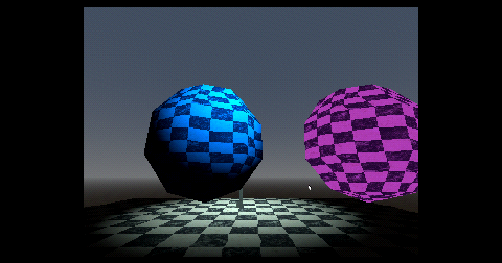
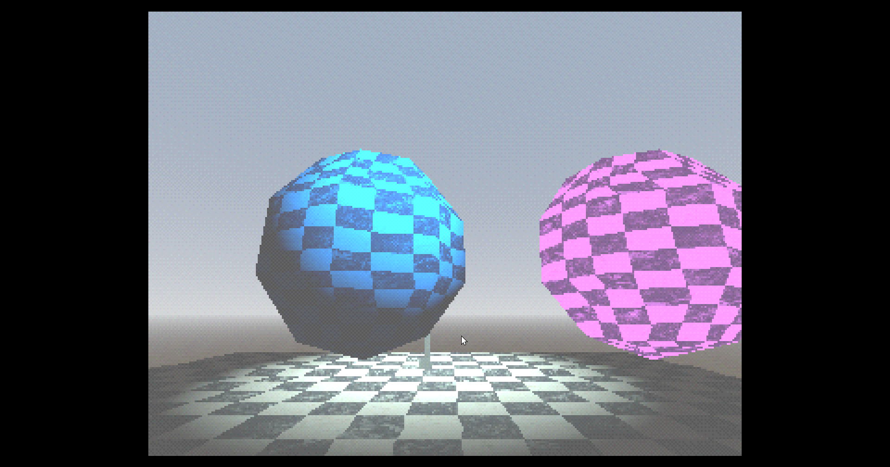
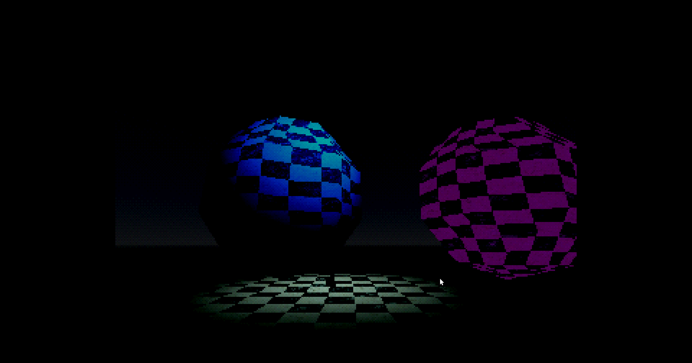

# :tv: GodotPSX

A small pack of shaders to replicate that old PS1 look in Godot 4.0.  
They may also work on Godot 3.x, but they haven't been tested. Proceed with caution!

> [!WARNING]  
> Gouraud shading is currently broken in Godot 4.x, so use 3.x or wait until 4.4 releases if you need it.  
> Progress on the pull request can be tracked at [godotengine/godot#83360](https://github.com/godotengine/godot/pull/83360).

## :wave: Attributions

Lit and unlit shaders are based on work by **Mighty Duke**, which is licensed under the CC0 license.  
Dithering shader is based on work by the **Duckstation** emulator team.

Dithering shader is based on: https://github.com/stenzek/duckstation/blob/master/src/core/gpu_hw_shadergen.cpp  
Lit and unlit shaders are based on: https://godotshaders.com/shader/ps1-shader/

Thanks to the [HauntedPS1](https://twitter.com/hauntedps1) community for inspiration and help with the Fade shader quantization.

## :thinking: Usage

Refer to [this](USAGE.md) document for instructions.  
Of course, you'll require a basic understanding on importing and using shaders.

# :framed_picture: Screenshots

  

 

# :balance_scale: License

These shaders are licensed under the [MIT License](LICENSE).  
This license allows you to use these shaders in your game, even if its closed-source software, as long as you keep the license and copyright notices
for these shaders.

> [!WARNING]  
> THE SOFTWARE IS PROVIDED "AS IS", WITHOUT WARRANTY OF ANY KIND, EXPRESS OR
IMPLIED, INCLUDING BUT NOT LIMITED TO THE WARRANTIES OF MERCHANTABILITY,
FITNESS FOR A PARTICULAR PURPOSE AND NONINFRINGEMENT. IN NO EVENT SHALL THE
AUTHORS OR COPYRIGHT HOLDERS BE LIABLE FOR ANY CLAIM, DAMAGES OR OTHER
LIABILITY, WHETHER IN AN ACTION OF CONTRACT, TORT OR OTHERWISE, ARISING FROM,
OUT OF OR IN CONNECTION WITH THE SOFTWARE OR THE USE OR OTHER DEALINGS IN THE
SOFTWARE.
